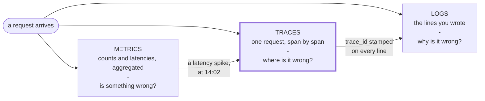

# @omob/otel-kit

OpenTelemetry setup for Node services, in one function call.



Those are the three signals of observability, and they answer different questions. Metrics tell you *something* broke. Traces tell you *where* — which service, which query, which call. Logs tell you *why*, once you know where to look.

Tracing is the one that connects the other two, and it is what this package is mostly for. You pick where traces, metrics and logs go; it handles the SDK, the sampling, the shutdown flush, and the boilerplate around spans — and stamps `trace_id` into your logs so the third column lines up with the second.

## Install

```bash
npm install @omob/otel-kit @opentelemetry/api
```

That is everything for most setups. OTLP — protobuf, JSON and gRPC — and Prometheus are already included.

Extra packages are needed for Google Cloud only, and which one depends on the route you take:

| If you use | Install |
| --- | --- |
| `ExporterType.GCP` for **traces** | `@google-cloud/opentelemetry-cloud-trace-exporter` |
| `ExporterType.GCP` for **metrics** | `@google-cloud/opentelemetry-cloud-monitoring-exporter` |
| Google Cloud over **OTLP** | `google-auth-library` — and neither of the above |

They are independent: exporting traces to Google needs the trace package only. Google is deprecating both in favour of the OTLP route, which is covered under [recipes](https://github.com/omob/otel-kit/blob/main/docs/recipes.md).

If you pick an exporter whose package is not installed, startup fails and names the package.

## Quick start

Create `src/instrumentation.ts`:

```ts
import "dotenv/config";
import { ExporterType, Telemetry } from "@omob/otel-kit";

Telemetry.start({
  serviceName: "my-service",
  serviceVersion: process.env.APP_VERSION,
  environment: process.env.NODE_ENV,
  enabled: process.env.NODE_ENV !== "test",
  traces: {
    exporter: ExporterType.CONSOLE,
    sampleRatio: Number(process.env.OTEL_TRACES_SAMPLE_RATIO ?? 1),
  },

  // logs stay off until you add their block. Uncomment to bridge your existing pino or
  // winston output, with its trace id, without changing how you log.
  // logs: { exporter: ExporterType.OTLP, otlp: { url: process.env.OTEL_EXPORTER_OTLP_LOGS_ENDPOINT } },

  instrumentation: { ignoreIncomingPaths: ["/health"] },
});
```

`CONSOLE` needs no infrastructure — spans print to stdout, so you can confirm tracing works before you have anywhere to send it. Swap it for a real destination once you do:

```ts
traces: {
  exporter: ExporterType.OTLP,
  otlp: { url: process.env.OTEL_EXPORTER_OTLP_TRACES_ENDPOINT },
  sampleRatio: Number(process.env.OTEL_TRACES_SAMPLE_RATIO ?? 1),
}
```

Once traces go over OTLP, **metrics start flowing to the same place too** — see [Metrics and logs](#metrics-and-logs) for what that sends and how to stop it.

**Nothing listens on port 4318 unless you run something there.** If you point at a collector that is not up, every export fails with `ECONNREFUSED` and you see no error at all — OpenTelemetry's internal logging is off by default. The quickest real destination is Jaeger, which ingests OTLP directly:

```bash
docker run -d --name jaeger -p 16686:16686 -p 4318:4318 jaegertracing/all-in-one:1.62.0
```

Then set `OTEL_EXPORTER_OTLP_TRACES_ENDPOINT=http://localhost:4318/v1/traces` and open the UI at http://localhost:16686. Jaeger stores traces only, so also set `OTEL_METRICS_EXPORTER=none`, or the kit keeps trying to send it metrics it has nowhere to put.

Load it before your app:

```json
{ "scripts": { "start": "node --require ./dist/instrumentation.js dist/server.js" } }
```

If your app is ESM (`"type": "module"`), use `--import` instead, and keep it on the command line rather than as an `import` at the top of your entry file:

```json
{ "scripts": { "start": "node --import ./dist/instrumentation.js dist/server.js" } }
```

ESM links every module in the graph before any of them runs, so an `import "./instrumentation.js"` inside `server.js` starts telemetry after Fastify, ioredis or kafkajs have already loaded — too late to patch them. `--import` runs first. Node 18.19 or later is needed for ESM instrumentation; on older runtimes only CommonJS requires are patched.

That's it. HTTP, database and framework calls are traced automatically.

Keep the ratio at 1 while you are setting things up. Sampling below 1 is a production concern, and turning it down before you have seen a single trace is the most common reason nothing appears in a backend. Dial it down later with the env var.

**On Fastify, install `@fastify/otel` and turn it on.** It ships disabled, along with `fs`:

```ts
instrumentation: { enable: [InstrumentationName.FASTIFY], ignoreIncomingPaths: ["/health"] }
```

Without it, every request is one bare `GET` span with no `http.route`, so nothing groups by route. Express, Koa, Hapi, NestJS, Mongo, Postgres, Redis, Kafka and outbound HTTP need no such step — they are on by default. Fastify is different because the OpenTelemetry-owned instrumentation was deprecated in favour of the Fastify team's own `@fastify/otel`, which this package loads when you enable it (`npm i @fastify/otel`).

### Why `--require`

Instrumentation can only patch libraries loaded *after* it starts. `--require` guarantees that.

Importing it at the top of your entry file also works, as long as nothing you want traced is imported above it. One reordered import and tracing silently stops — hence the flag.

## What every signal carries

Every span, metric and log is stamped with who sent it, so a backend can tell services, versions and replicas apart:

| Attribute | Where it comes from |
| --- | --- |
| `service.name` | `serviceName` |
| `service.version` | `serviceVersion`, or, if you leave it out, the version in the `package.json` npm or pnpm ran your start script from — so each deploy shows up as a new version |
| `service.instance.id` | a random id per process, so replicas are counted separately; set your own through `resourceAttributes` or `OTEL_RESOURCE_ATTRIBUTES`, such as the pod name |
| `deployment.environment.name` | `environment` |
| `ritele.trace.sample_probability` | the chance this service keeps a trace it starts, when it exports traces; see [below](#describing-your-architecture) |
| `telemetry.sdk.*` | the OpenTelemetry SDK's name, language and version |
| `host.*`, `process.pid`, `process.runtime.*` | detected at startup |

The detected process details leave out your command line, script path and user name, because flags often carry secrets.

**In a monorepo, check `service.version`.** A start script run from the repo root reports the root `package.json`'s version (often `0.0.0`) for every service. Set `serviceVersion` yourself there.

## Your own spans

`withSpan` runs your function inside a span. It starts the span, makes it the parent of anything that happens inside, ends it when your function settles, and records the error if one is thrown.

Add one when you want a step to show up as its own line in the trace: a slow query, an external API call, a step you suspect. Skip it for cheap in-memory work — a span costs more than the code it measures.

```ts
import { withSpan } from "@omob/otel-kit";

async function login({ email, password }) {
  return withSpan("login", { attributes: { "auth.method": "password" } }, async (span) => {
    const user = await findUser(email);
    span.setAttribute("user.id", user.id);

    return withSpan("token.generate", () => generateToken(user));
  });
}
```

Throw anywhere inside and the span is marked failed, the exception is recorded, and the error still propagates to your caller unchanged. Spans always end, on success or failure.

Two shorthands help when a backend is drawing a dependency graph from your spans: `peer` names the remote side of a call that has no instrumentation of its own, and `component` names the logical part of your service the work belongs to.

```ts
import { SpanKind } from "@opentelemetry/api";

declare const paystack: { charge(order: { id: string; amount: number }): Promise<unknown> };

async function charge(order: { id: string; amount: number }) {
  return withSpan("charge.card", { kind: SpanKind.CLIENT, peer: "paystack", component: "billing" }, () =>
    paystack.charge(order)
  );
}
```

## Describing your architecture

If you run something that builds a system diagram from traces, tell it what this service is. None of this changes what is traced; it adds resource attributes and a second, independent sampling decision.

```ts
Telemetry.start({
  serviceName: "wallet-service",
  traces: { exporter: ExporterType.OTLP, sampleRatio: 0.01 },
  architecture: {
    component: { type: ArchitectureComponentType.SERVICE, layer: "core", domain: "payments", owner: "team-wallet" },
    intendedDependencies: ["postgresql:ledger", "kafka:transfers", "paystack"],
    concurrency: { http: 200, pgPool: 20 },
    docTraceRatio: 0.02,
    peers: { "api.paystack.co": "paystack" },
  },
});
```

`docTraceRatio` is the useful one. Sampling 1% of traffic keeps costs down, but a rarely-used dependency can go unseen for days. Documentation traces are a separate 2%, taken from the end of the range your sample ratio never reaches, always recorded, and marked in `tracestate` so every service downstream records them too. A backend can keep those at 100% and drop the rest, and the map stays complete.

Each exporting service also carries `ritele.trace.sample_probability`: how likely it is to keep a trace **it starts**. That is `sampleRatio + docTraceRatio`, capped at 1 — the two ranges never overlap, so they simply add. With the settings above it is 0.03, so a backend can multiply a count of this service's root spans by about 33 to estimate the real number. It says nothing about traces that arrive from a caller: those are kept or dropped by the caller's decision. The attribute is left out when you pass your own `traces.sampler`, since the kit can't know its rate.

The attribute names live under `ritele.*`, the namespace of [Ritele](https://github.com/omob/ritele); any other backend ignores them.

Not every failure is a fault. A wrong password is an expected outcome, and marking it as a span error means your error rate tracks how often users mistype. Pass `isError` to say which throws actually count:

```ts
withSpan("login", { isError: (e) => !(e instanceof AppError) || e.statusCode >= 500 }, handler);
```

Never put emails, tokens or passwords in attributes — spans are stored unredacted.

Two more helpers:

```ts
import { currentTraceId, getTracer } from "@omob/otel-kit";

currentTraceId();            // trace id of the active span, or undefined
getTracer("auth-module");    // pass as `tracer` in withSpan options to name the scope
```

`currentTraceId()` is worth putting in your error handler, so support can jump from an error response straight to the trace:

```ts
fastify.setErrorHandler((err, request, reply) =>
  reply.status(err.statusCode ?? 500).send({ message: err.message, traceId: currentTraceId() })
);
```

## Metrics and logs

Neither needs code beyond the config.

### Metrics

**If your traces go over OTLP, metrics are already on.** You don't add anything: every 30 seconds the kit sends metrics to the same collector as your traces. Most collectors, and backends such as Ritele, accept both.

They carry the headers you set in code (`traces.otlp.headers`) or in `OTEL_EXPORTER_OTLP_HEADERS`. If your auth lives only in `OTEL_EXPORTER_OTLP_TRACES_HEADERS`, it is not copied: set `OTEL_EXPORTER_OTLP_METRICS_HEADERS` as well, or the metrics are sent without it and rejected.

Where exactly they go:

| Your setup | Metrics are sent to |
| --- | --- |
| `traces.otlp.url` ends in `/v1/traces` | the same URL, ending in `/v1/metrics` instead |
| the traces URL comes from `OTEL_EXPORTER_OTLP_TRACES_ENDPOINT` | the same, from that variable |
| `OTEL_EXPORTER_OTLP_METRICS_ENDPOINT` is set | that endpoint, with only the headers you gave it in `OTEL_EXPORTER_OTLP_METRICS_HEADERS` or `OTEL_EXPORTER_OTLP_HEADERS` — never your traces headers, since it may be another vendor |
| gRPC | the same endpoint as traces |
| no URL in code or in either variable above | wherever your traces go: `OTEL_EXPORTER_OTLP_ENDPOINT` if set, otherwise the local default (`localhost:4318`, or `4317` for gRPC) |
| a traces URL with any other path | nowhere — the kit can't guess, so metrics stay off |

**To turn them off**, set `OTEL_METRICS_EXPORTER=none`, or pass `metrics: { exporter: ExporterType.NONE }`. Do this if your backend only takes traces (Jaeger, for example) or charges per metric series. The variable only switches off this default — it has no effect once you write a `metrics` block, and other values such as `console` are ignored.

**To change an option**, such as the interval or `cpuUsage`, write a `metrics` block with `exporter: ExporterType.OTLP` and no URL. It keeps the collector and headers worked out above. **To send them somewhere else**, give the block its own URL:

```ts
metrics: {
  exporter: ExporterType.OTLP,
  otlp: { url: process.env.OTEL_EXPORTER_OTLP_METRICS_ENDPOINT },
  exportIntervalMillis: 30_000,
}
```

If your traces don't go over OTLP, metrics stay off until you add that block.

**What you get**, with no instrumentation of your own:

| Metric | What it tells you |
| --- | --- |
| `http.server.request.duration`, `http.client.request.duration` | Request latency in and out, in seconds, by route and status |
| `nodejs.eventloop.delay.p50` / `p90` / `p99`, `nodejs.eventloop.utilization` | How busy the event loop is — usually the first thing to saturate on a Node service |
| `v8js.memory.heap.*` | Heap usage against its limit |
| `messaging.client.sent.messages`, `messaging.client.consumed.messages`, `messaging.process.duration` | Kafka throughput and handler time, if you use kafkajs |

The event loop and heap metrics stay on even when you narrow things down with `instrumentation.only`. Set `runtimeMetrics: false` to drop them.

> **Dashboards on `http.server.duration`?** That is the old name, in milliseconds, from earlier versions of the HTTP instrumentation. The one bundled here reports only `http.server.request.duration`, in seconds, and `OTEL_SEMCONV_STABILITY_OPT_IN` no longer switches it back. Point those dashboards and alerts at the new name.

For a pull-based setup, swap the exporter and Prometheus scrapes you instead:

```ts
metrics: { exporter: ExporterType.PROMETHEUS, prometheus: { port: 9464 } }
```

### Logs

Logs are off until you add a `logs` block:

```ts
logs: { exporter: ExporterType.OTLP, otlp: { url: process.env.OTEL_EXPORTER_OTLP_LOGS_ENDPOINT } }
```

You do not change how you log. If you use pino, winston or bunyan, the log instrumentation bridges what you already write into OpenTelemetry, carrying the `trace_id` that ties each line to its span — so a trace links straight to the logs from that request.

Two things to weigh before turning logs on. Your log volume goes to two places, so you pay to store it twice unless you drop stdout collection. And any gap in your redaction now reaches a second system: check what your logger emits — response bodies and auth headers are the usual leaks — before pointing it at a backend.

## Connection pools

A slow query and a query stuck waiting for a free connection look the same from outside. The difference only shows inside your process, where the pool knows its limit (`max: 20`) and how many callers are queued. Register the pool and the kit reports it:

```ts
import { observeConnectionPool } from "@omob/otel-kit";

const pool = new Pool({ max: 20 });

observeConnectionPool({
  name: "biller",
  system: "postgresql",
  read: () => ({
    max: pool.options.max,
    used: pool.totalCount - pool.idleCount,
    idle: pool.idleCount,
    pending: pool.waitingCount,
  }),
});
```

Call it **after** `Telemetry.start()`. A pool registered earlier gets a do-nothing meter and reports nothing, for good.

You get:

| Metric | What it tells you |
| --- | --- |
| `db.client.connection.max` | The pool's limit |
| `db.client.connection.count`, split into `used` and `idle` | How much of it is in use |
| `db.client.connection.pending_requests` | Callers waiting for a connection |
| `db.client.connection.wait_time` | How long they waited, if you call the returned `recordWait(millis)` when you acquire one |

A pool at its limit with a queue behind it means the bottleneck is your pool size, not the database. It works with any pool — Postgres, MySQL, Mongo, Redis — because you supply the `read` function.

**Using `pg`?** The pg instrumentation also reports these metrics for `pg-pool`, under the same names. Its numbers are only right while you have a single pool: with two or more, its counts drift and can go negative. Register your pools here anyway, and have your backend read the `@omob/otel-kit` scope. Ritele prefers these measured numbers over `architecture.concurrency.pgPool`, which it only uses for a pool nothing measures.

## CPU capacity

To predict when a service runs out of CPU, a backend needs how much CPU each process uses and how much each replica is allowed. Turn on the first with `metrics.cpuUsage` and state the second with `architecture.cpuLimit`:

```ts
Telemetry.start({
  serviceName: "wallet-service",
  metrics: { exporter: ExporterType.OTLP, cpuUsage: true },
  architecture: { cpuLimit: 0.5 },
});
```

That emits `process.cpu.time`, split by `cpu.mode`, and the resource attribute `ritele.cpu.limit`. Replicas are counted from `service.instance.id`, which the kit sets to a random id per process unless you supply one. To observe CPU without the config flag, call `observeCpuUsage()` after `Telemetry.start()`; it returns `{ stop }`. See [Recipes](https://github.com/omob/otel-kit/blob/main/docs/recipes.md) for reading the limit from Kubernetes.

## More

- [Configuration](https://github.com/omob/otel-kit/blob/main/docs/configuration.md) — every option, shutdown behaviour, and what happens when a config is rejected
- [Recipes](https://github.com/omob/otel-kit/blob/main/docs/recipes.md) — Jaeger, Google Cloud, Prometheus, gRPC collectors, per-instrumentation options
- [Troubleshooting](https://github.com/omob/otel-kit/blob/main/docs/troubleshooting.md) — no traces appearing, wrong service name, broken propagation
- [Concepts](https://github.com/omob/otel-kit/blob/main/docs/concepts.md) — traces, spans, sampling and propagation, if OpenTelemetry is new to you

## Licence

MIT
